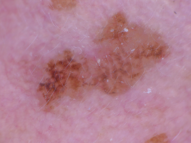
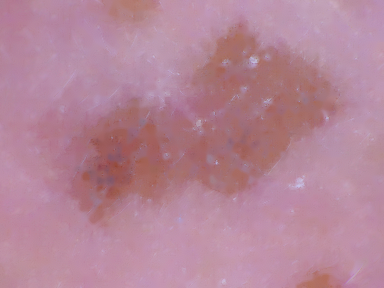
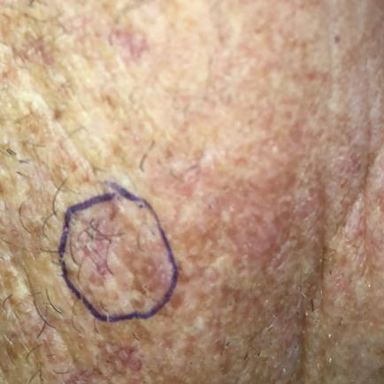
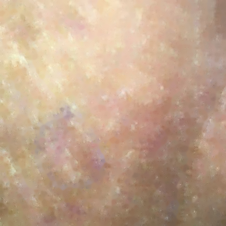
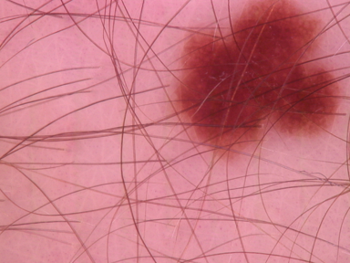
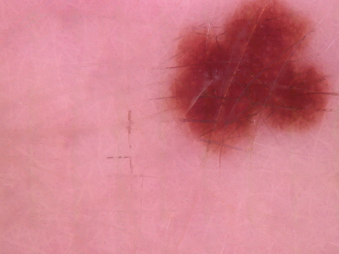
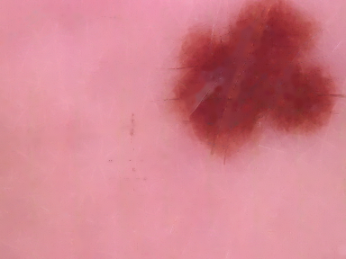
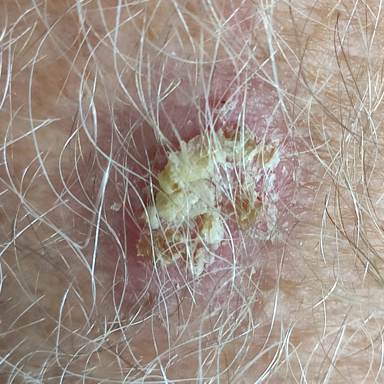
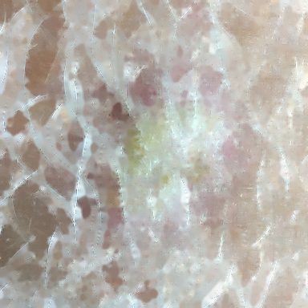

# Projects in Data Science (2025)

## Background of the problem 
The main purpose of given assignment is to classify skin lessions. Skin lesions are defined as areas of skin that visually differ from the surrounding tissue. They are relatively common and can develop from a variety of causes, including trauma, genetic factors, infection or autoimmune disorders. 

To support our analysis, we determine the number of hairs in each image and preprocess the images by removing hairs to improve the visibility of the lesions. This preprocessing step enhances the accuracy of lesion identification and classification, helping to distinguish lesions associated with potential diseases from those caused by non-cancerous factors.

Additionally, we tested different parameters, such as varying kernel sizes, thresholds, and radii. Image 0410 was uploaded twice to illustrate this process. We do this because we want to check if lowering the threshold successfully removes smaller hairs.

## Analysis 
We analysed the result.csv dataset:
1. Count how many times each person voted for images with rankings 0, 1, or 2.
2. Check which are the most disagreed on pictures and then perform hair removal on them.

Observations:

1. Vote Counts for Each Person (0, 1, 2):

| Person | 0  | 1  | 2  |
|--------|----|----|----|
| Dara   | 68 | 79 | 53 |
| Marta  | 67 | 77 | 56 |
| Filip  | 76 | 72 | 52 |
| Philip | 58 | 78 | 64 |
| Maja   | 70 | 82 | 52 |

2. Images, on which hair level we disagreeded on

| Image         | Votes for 0 | Votes for 1 | Votes for 2 | Agreeing 0               | Agreeing 1             | Agreeing 2 |
|---------------|-------------|-------------|-------------|--------------------------|------------------------|------------|
| img_0395.png  | 3           | 1           | 1           | [Dara, Marta, Filip]      | [Philip]               | [Maja]     |
| img_0513.png  | 1           | 3           | 1           | [Filip]                   | [Dara, Marta, Philip]  | [Maja]     |

Performing analysis of our results (the analysis can be found in file "analysis_results.ipynb"), we found two examples with significant differences in the opinions. 

In img_0395.png due to using small enough threshold we were able to remove the hiar, which was unnoticeable to some participants of our group (Dara, Marta, Filip)

In img_0513.png, where the limited amount of hair is present, the function succesfully removed the hair, however it also removed both the natural pigmentation and the pen marks, which was not intended.

## Hair Segmentation Examples
Hair Segenation was conducted using the TELEA method, based on the template code from the lecture. Below are examples of visually successful and unsuccessful results:

### Good results
In order to analyze the process of hair removal, we choose an image "img_0410.png", as we all marked its hair level as 2, which implies a big amount of hair. We can see that hair on picture "img_0410.png", were removed almost scompletely for kernel= 25, and threshold= 10, however a limited amount of hair is still left in the place of the darker spot. 

After decreasing the threshold to 2, we can observe a complete succesful hair removal even in teh dark areas, it occurs as the black hat image detects contrats, not only hair, and bigger threshold (=10) ignored fine details in the darker spot as the difference between colors was not strong enough, applying threshold = 2 we were able to achieve the detection of more fine details. 

### Bad results
However, the results are not as satisfactionary on image "img_0414.jpg", where also a significant amount of hair is present [hair level= 2 marked by all of us]. In contradiction to the former example, the hair on the image is white, despite the fine color of the hair, the black hat image mask worked great, as there is a still crucial contrast between the skin color and the color of the hair. However, while even the white hair was succesfully removed, the inpainting left significant white spots in place of the hair.

 

